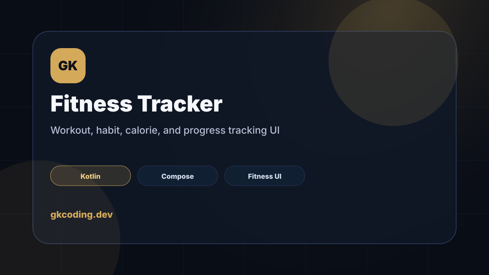

# GK Compose Fitness Tracker



Jetpack Compose fitness tracker demo by **GK Coding**.

This project demonstrates a clean Android product UI for workouts, habits, calories, and progress tracking.

## Features

- Kotlin Android app
- Jetpack Compose UI
- Material 3 dark premium theme
- Workout cards
- Habit progress tracking
- Dashboard stats

## Tech

`Kotlin` · `Jetpack Compose` · `Material 3` · `Android Studio`

## Verify

```bash
./gradlew :app:assembleDebug
```

## Purpose

Portfolio/demo project for showing Android UI implementation, information hierarchy, and state-ready product screens.
